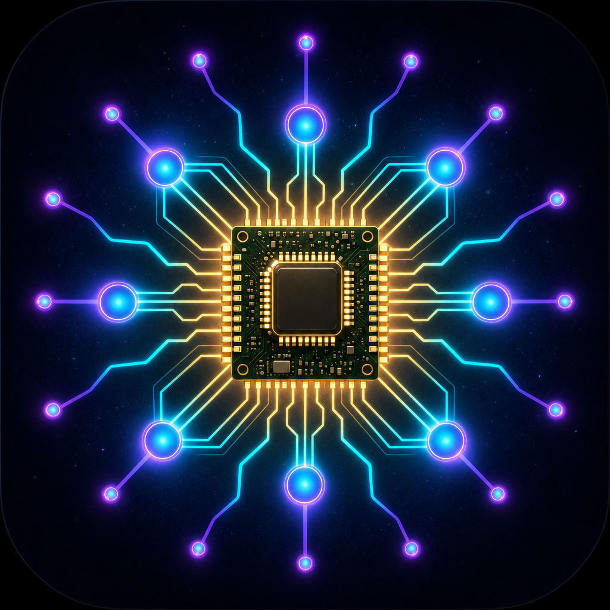
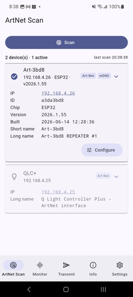
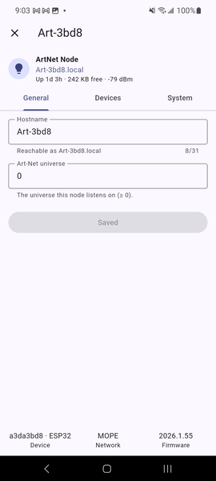
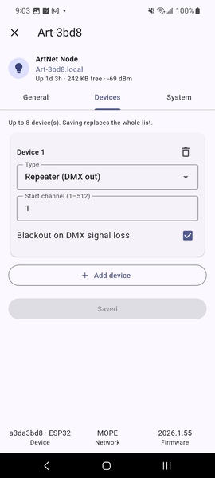
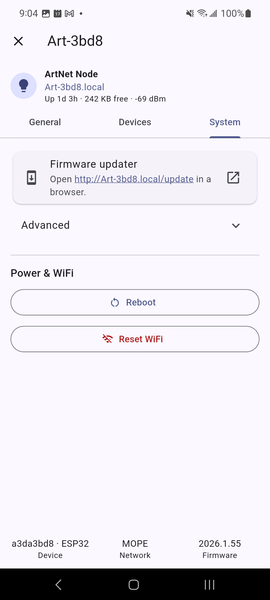
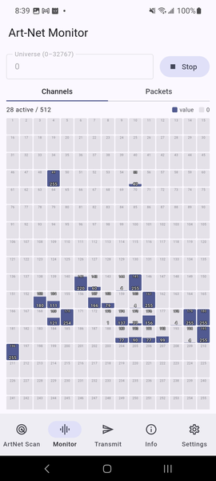
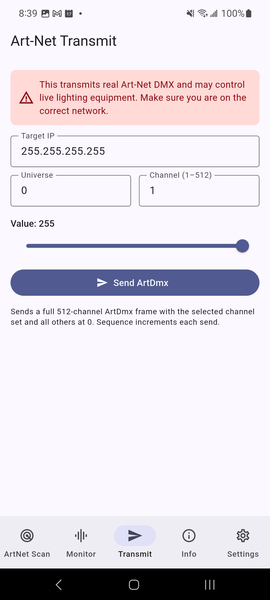
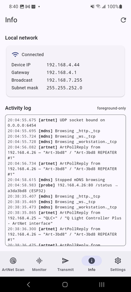
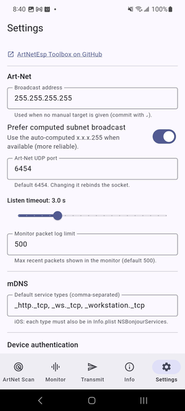

# Welcome to ArtNetEsp Toolbox

### This is a companion application for [ArtNetEsp](https://github.com/byteor/ArtNetEsp) project

Discover **Art-Net** devices and control **ArtNetEsp** nodes on your local
network.



## Getting started

1. [Build and deploy](#setup) the app.
2. Put mobile device on the **same Wi-Fi / LAN** as your Art-Net hardware.
3. Tap **Scan** to look for devices.
4. For an active device you can:
   - tap its **IP** to open the device's web page in a browser, or
   - tap **Configure** to edit its settings over the REST API (depends on device firmware version).

### Tips

- Guest networks and **AP/client isolation** often block discovery — use a
  normal LAN if a scan finds nothing.
- On **iOS**, accept the _Local Network_ permission prompt on the first scan.

## What it is

A minimal but real **Flutter** app (Android + iOS + macOS) for local-network
discovery and control of **ArtNetEsp** nodes.
Also it can view ArtNet activity on the network.

This is a **native Flutter app** — not a WebView wrapper. UDP uses `dart:io`
sockets; mDNS uses the OS service-discovery stack via the `nsd` plugin.

## What it does

  <table border="0">
    <tr>
      <td>
        <b>ArtNet Scan</b><br/>
        One pass discovers devices three ways and merges the result:
        it sends <b>ArtPoll</b> (UDP 6454) and parses <b>ArtPollReply</b>, browses the mDNS
        service types, and probes each host over HTTP. Each device is a card showing its
        IP (a link that opens the device's web page), short/long name and — for
        ArtNetEsp nodes — chip/firmware; source chips mark how it was found.
        </td>
        <td width="200pt">
          
      </td>
    </tr>
    <tr>
      <td colspan=2>
        <b>Configure</b><br/>
        For an active (responding) device on the Scan list, opens a
        full-screen editor that mirrors the firmware's web config UI
        (General · Devices · System) and writes changes over the device REST API,
        including reboot and WiFi-reset. For devices with HTTP auth enabled it tries the
        default credentials from Settings (then any remembered for that device), asks
        once if those fail, and remembers working credentials per device. See
        <a href="docs/DEVICE_CONFIG_PARITY.md">docs/DEVICE_CONFIG_PARITY.md</a>
        <br/>
        <div align="center">
          
          
          
        </div>
      </td>
    </tr>
    <tr>
      <td>
        <b>Monitor</b><br/>
        Listens for `ArtDmx` on a chosen universe; a <b>Channels</b> sub-tab
        shows the live 512-channel fader grid and a <b>Packets</b> sub-tab shows source IP,
        packet count, last sequence and a rolling packet log. UI updates are throttled
        (~10 Hz) so high packet rates never freeze the app.
      </td>
      <td>
        
      </td>
    </tr>
    <tr>
      <td>
        <b>Transmit</b><br/>
        Sends a valid 512-channel <b>ArtDmx</b> frame with one test channel
        set. Carries a clear warning that it can drive real lighting.
      </td>
      <td>
        
      </td>
    </tr>
    <tr>
      <td>
        <b>Info</b><br/>
        Wi-Fi/local-network status (IP, gateway, broadcast, mask), Art-Net +
        mDNS counts, last scan times, and a live activity log. The network status
        auto-refreshes when the device changes network (e.g. switching Wi-Fi), showing a
        "Network changed" notice and recovering the Art-Net socket so the next scan
        still works.
      </td>
      <td>
        
      </td>
    </tr>
    <tr>
      <td>
        <b>Settings</b><br/>
        Broadcast address, prefer-computed-broadcast toggle, Art-Net
        UDP port, mDNS service types, listen timeout, monitor packet-log limit,
        default device HTTP-auth credentials, debug-logging toggle. Persisted with
        `shared_preferences`, except device credentials (default + per-device), which
        are stored <b>encrypted</b> via `flutter_secure_storage` (Keychain / Android
        Keystore)
      </td>
      <td>
        
      </td>
    </tr>
  </table>

## What it does NOT do (yet)

- No background operation (foreground-only by design).
- No sACN/E1.31, RDM, Art-Net sync/timecode, or full ArtPollReply field set.
- No in-app WiFi configuration or OTA firmware upload (use the device's captive
  portal and its `/update` page); all other device settings are editable in-app
  via **Configure**.
- No persistence of discovered nodes/logs across launches.
- Single universe monitored at a time.

## Setup

### Requirements

- Flutter (stable). Developed against **Flutter 3.44 / Dart 3.12**.
- Xcode + CocoaPods for iOS; Android SDK (API as per `flutter.minSdkVersion`)
  for Android. A **real device** is needed to meaningfully test local-network
  features (see below).

### Setup and Run

```bash
# 1. Install the toolchain (macOS). Installs Flutter, CocoaPods, Android SDK.
bash scripts/bootstrap.sh

# 2. Fetch packages.
flutter pub get

# 3. Static analysis + unit tests (no device needed).
flutter analyze
flutter test

# 4. Run on a connected device.
flutter devices
flutter run            # add -d <deviceId> to choose
```

> The `android/` and `ios/` folders are generated by `flutter create`. If you
> ever regenerate them, re-apply the native edits described below.

### iOS setup notes

- `ios/Runner/Info.plist` already declares:
  - `NSLocalNetworkUsageDescription` — the Local Network permission prompt
    (iOS 14+). The first scan/browse triggers the system prompt; **accept it**.
  - `NSBonjourServices` — the Bonjour types the app may browse. **iOS only
    browses types listed here.** If you add a custom mDNS type at runtime, add
    it to this array too or it will silently fail to resolve on iOS.
- No multicast entitlement is required: Art-Net uses broadcast/unicast UDP, and
  mDNS goes through the system Bonjour resolver. (sACN/E1.31 or a raw-Dart mDNS
  implementation _would_ need `com.apple.developer.networking.multicast`, which
  requires Apple approval.)
- Test on a **real iPhone/iPad** — the Simulator does not behave like a device
  for local-network broadcast/permission. See [docs/IOS_LOCAL_NETWORK.md](docs/IOS_LOCAL_NETWORK.md).

### Android setup notes

- `android/app/src/main/AndroidManifest.xml` declares `INTERNET`,
  `ACCESS_NETWORK_STATE`, `ACCESS_WIFI_STATE` and `CHANGE_WIFI_MULTICAST_STATE`.
- `MainActivity.kt` adds a `artnet_poc/multicast_lock` MethodChannel. The app
  holds a Wi-Fi **multicast lock** while scanning/monitoring so the OS does not
  drop inbound broadcast/multicast (which would otherwise make discovery see
  nothing on some devices).
- We do **not** read the Wi-Fi SSID/BSSID, so **no location permission** is
  required.

## Install on a physical device

> Local-network features (Art-Net broadcast, mDNS) only behave correctly on a
> **real device** — install on hardware rather than trusting a simulator/emulator.

### iPhone (iOS)

Needs a Mac with **Xcode** + **CocoaPods**, a USB cable (or same Wi-Fi for
wireless), and an **Apple ID** (a free one works — see the limitation below).

1. **Enable Developer Mode** on the iPhone (iOS 16+):
   Settings › Privacy & Security › **Developer Mode** → On → restart the phone.
2. **Connect** the iPhone by USB and tap **Trust This Computer** on the phone.
3. **Set up signing once in Xcode** (required so a free Apple ID can register the
   device and create a provisioning profile):

   ```bash
   open ios/Runner.xcworkspace
   ```

   - Select the **Runner** target → **Signing & Capabilities**.
   - Tick **Automatically manage signing** and choose your **Team** (add your
     Apple ID first under Xcode › Settings… › Accounts if it isn't listed).
   - Change **Bundle Identifier** to something unique you own, e.g.
     `com.yourname.artnetpoc` — the default `com.example.…` will not sign.

4. **Build & run** from the CLI:
   ```bash
   flutter devices                 # find your iPhone's <device-id>
   flutter run -d <device-id>      # debug build with hot reload
   # …or a standalone install you can keep using after unplugging:
   flutter run -d <device-id> --release
   ```
5. **Trust the developer certificate** on first launch:
   iPhone Settings › General › **VPN & Device Management** → tap your Apple ID →
   **Trust**, then re-open the app.
6. **Accept the Local Network prompt** the first time you scan/browse. (If you
   tapped Deny: Settings › Privacy & Security › Local Network → enable ArtNetEsp Toolbox.)

> **Free Apple ID limit:** apps signed with a free account expire after **7 days**
> (max 3 installed) and must be re-run from Flutter/Xcode to renew. A paid
> **Apple Developer Program** ($99/yr) removes this and lets you build a shareable
> archive with `flutter build ipa`.

Wireless (optional): connect once by USB, then in Xcode › Window › **Devices and
Simulators** tick **Connect via network**; afterwards `flutter run -d <id>` works
over Wi-Fi.

### Android phone

Needs a **complete Android SDK** (see [Setup](#setup) / `scripts/bootstrap.sh` —
cmdline-tools, a platform, build-tools and accepted licenses) and a USB cable.

1. **Enable Developer options**: Settings › About phone → tap **Build number**
   seven times. Then Settings › System › Developer options → enable
   **USB debugging**.
2. **Connect** by USB and tap **Allow** on the "Allow USB debugging?" prompt
   (tick _Always allow from this computer_).
3. **Build & run**:
   ```bash
   flutter devices                 # confirm the phone is listed
   flutter run -d <device-id>      # debug build with hot reload
   ```
4. **Or build a shareable APK** to sideload without a cable:
   ```bash
   flutter build apk --release
   # -> build/app/outputs/flutter-apk/app-release.apk
   ```
   Copy the APK to the phone and open it; allow **Install unknown apps** for your
   file manager/browser when prompted. (Network permissions are granted at
   install time — no runtime prompt; the app holds a Wi-Fi multicast lock while
   scanning so inbound broadcast/mDNS isn't dropped.)

Wireless (Android 11+): under Developer options › **Wireless debugging** get the
pairing code, then `adb pair <ip:port>` and `adb connect <ip:port>`, then
`flutter run -d <id>`.

> The scaffold signs the release build with the **debug** key — fine for personal
> sideloading. For Play Store / wide distribution, add a real signing config in
> `android/app/build.gradle.kts`.

### macOS desktop (already set up)

This repo also has a macOS target with the App Sandbox network entitlements:
`flutter run -d macos`, or open `build/macos/Build/Products/Debug/ArtNetEsp Toolbox.app`.
The first scan triggers the macOS firewall "accept incoming connections" prompt —
click **Allow**. The Runner entitlements also grant **Keychain Sharing** (used by
`flutter_secure_storage` for encrypted device credentials); if you change the
macOS bundle id, update the `keychain-access-groups` group in
`macos/Runner/*.entitlements` to match.

## How to test

### Scan (Art-Net + mDNS)

1. Connect the phone to the same Wi-Fi/LAN as an Art-Net node (e.g. one of the
   ESP nodes).
2. Open the **ArtNet Scan** tab and tap **Scan**. A single pass sends `ArtPoll`
   (UDP 6454), browses the mDNS service types, and probes each discovered host
   over HTTP, then lists the merged result. Each device is a card showing its IP,
   short/long name and (for ArtNetEsp nodes) chip/firmware; source chips mark how
   it was found.
3. For an active (responding) device, expand its card and:
   - tap its **IP** to open the device's web page in a browser, or
   - tap **Configure** to edit its settings over the REST API.
4. On iOS, only mDNS types declared in `Info.plist` resolve (see above); accept
   the _Local Network_ prompt on the first scan.
5. No hardware? Use the Python `ArtPollReply` emitter in
   [docs/TESTING_CHECKLIST.md](docs/TESTING_CHECKLIST.md), or a desktop tool
   (QLC+, DMX Workshop).

### ArtDmx monitor

1. Open the **Monitor** tab, set the **Universe**, and tap **Listen**.
2. The **Channels** sub-tab shows the live 512-channel fader grid; the
   **Packets** sub-tab shows source IP, packet count, last sequence and a
   rolling packet log.
3. Tap **Stop** to release the socket (freeing the port for another listener).

### ArtDmx transmit

1. Open the **Transmit** tab. Read the warning.
2. Enter the **Target IP** (a node, or a broadcast address), **Universe** and
   **Channel** (1–512), then set the **Value** (0–255) with the slider. Tap
   **Send ArtDmx**.
3. Observe the fixture, or watch it in **Monitor** on another device / in the
   Python `ArtDmx` listener.

## Troubleshooting

| Symptom                                   | Likely cause / fix                                                                                                                                                                |
| ----------------------------------------- | --------------------------------------------------------------------------------------------------------------------------------------------------------------------------------- |
| Scan finds nothing                        | AP/client isolation or guest Wi-Fi blocks client-to-client traffic; try another network. On Android some devices filter broadcast — the multicast lock helps but isn't universal. |
| iOS finds nothing                         | Local Network permission was denied — enable it in **Settings › Privacy › Local Network**. Test on a real device, not the Simulator.                                              |
| iOS mDNS empty                            | The browsed service type isn't in `NSBonjourServices`. Add it and rebuild.                                                                                                        |
| "Failed to bind UDP 6454"                 | Another Art-Net app already owns the port. Close it, or change the port in Settings.                                                                                              |
| Limited broadcast 255.255.255.255 ignored | Common on iOS/some routers. Enable _Prefer computed subnet broadcast_ (default) or set a subnet-directed broadcast (e.g. 192.168.1.255) in Settings.                              |
| Transmit "Send failed"                    | Invalid target IP, or not bound. Check the IP and that you're on Wi-Fi.                                                                                                           |

## Known limitations

- Local-network behaviour varies by router/AP; corporate/guest networks and
  VPNs often block discovery.
- iOS limited broadcast is unreliable; prefer subnet-directed broadcast.
- High ArtDmx rates are throttled in the UI; counts remain accurate.
- See [docs/ARTNET_NOTES.md](docs/ARTNET_NOTES.md) for protocol details and
  [docs/TESTING_CHECKLIST.md](docs/TESTING_CHECKLIST.md) for a full manual test
  pass.

## Project layout

See [AGENTS.md](AGENTS.md) for the architecture, conventions, and how to extend
the app (new device types, new screens, safe packet changes).
